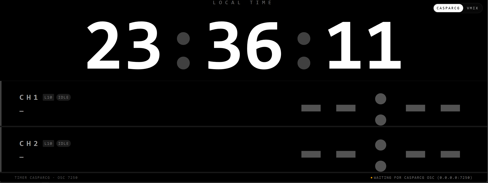
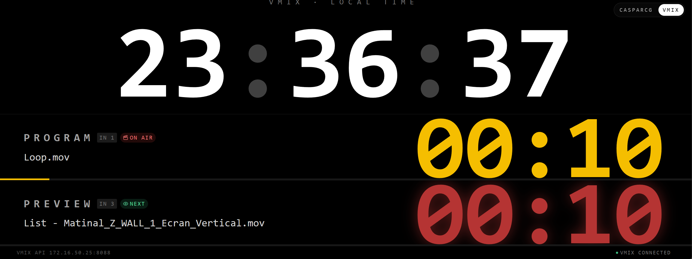

# Piosctimer

Web-based production timer for CasparCG, vMix and live broadcasting.

Piosctimer is a lightweight web-based timer designed for live broadcasting, sports production and professional production workflows.

It provides dedicated interfaces for CasparCG and vMix and is designed to run as a standalone production tool on a local network.

The application has been tested and is running reliably on a Raspberry Pi 4.

---

## CasparCG

Piosctimer includes a dedicated interface for CasparCG production workflows.

CasparCG interface:

http://your-IP:8001/

It communicates with CasparCG using OSC and provides channel status and timer information.

Tested with the latest CasparCG version.

Screenshot:

---

## vMix

Piosctimer also provides a dedicated interface for vMix.

vMix interface:

http://Your-IP:8001/vmix

The interface displays information from the vMix API, including:

- Program
- Preview
- Current media
- Next media
- Playback status
- Remaining time
- Connection status

Screenshot:

---

## Raspberry Pi 4

Piosctimer has been tested on a Raspberry Pi 4 and can be used as a dedicated production appliance.

A typical setup consists of a Raspberry Pi running Piosctimer on the production network, connected to CasparCG and/or vMix.

---

## Features

- Web-based production timer
- Dedicated CasparCG interface
- CasparCG OSC connectivity
- Dedicated vMix interface
- vMix API connectivity
- Raspberry Pi 4 support
- Local network operation
- Designed for live production and broadcasting
- Separate frontend and backend
- Deployment configuration included
- Testing resources included

---

## Development

Piosctimer started from a production requirement and was developed with assistance from Emergent, an AI-assisted development environment.

The application was iteratively developed and tested on real production hardware, including a Raspberry Pi 4.

---

## Contributing

Bug reports, suggestions and improvements are welcome.

Feel free to open an Issue or submit a Pull Request.

---

## License

See the repository for license information.

---

## Author

OmiduF

Built for real-world live production workflows.
